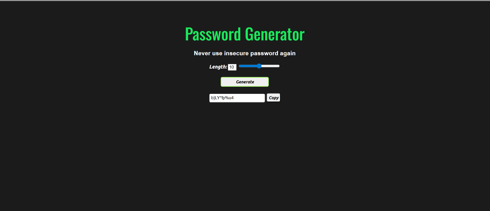

# 🔐 Password Generator

A simple and responsive **Password Generator** built using **HTML, CSS, and JavaScript**.  
It helps users create strong, random passwords with customizable length and easy copy functionality.

---

## 🚀 Features

- Generate strong random passwords
- Adjustable password length using slider
- Includes:
  - Uppercase letters
  - Lowercase letters
  - Numbers
  - Special characters
- One-click copy to clipboard
- Clean and modern UI

---

## 🛠️ Technologies Used

- **HTML5**
- **CSS3**
- **JavaScript (Vanilla JS)**

---

## 📸 Screenshot

---

## 📂 Project Structure
password-generator/
│── index.html
│── style.css
│── script.js

